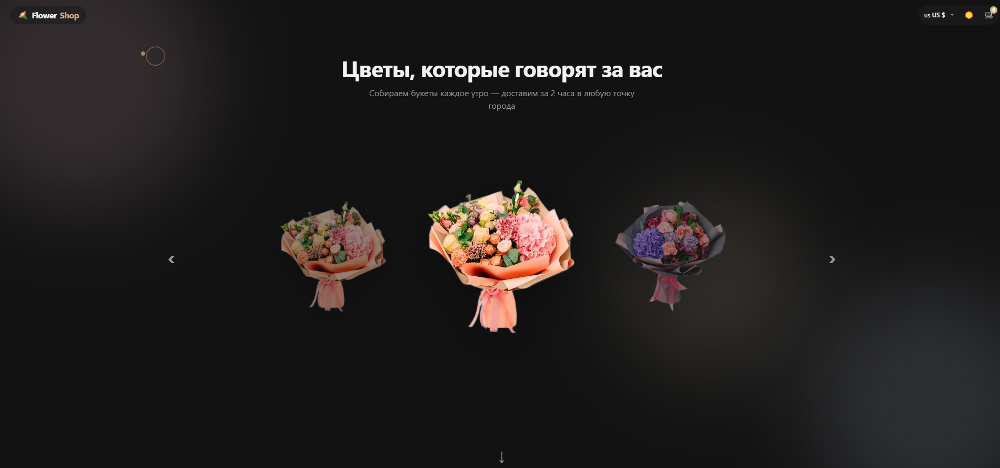
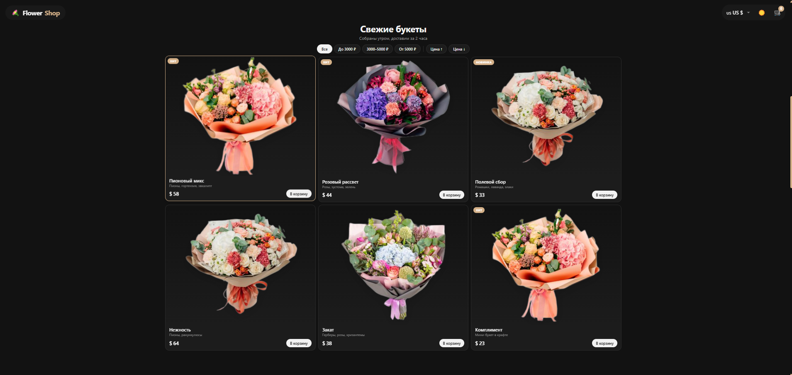
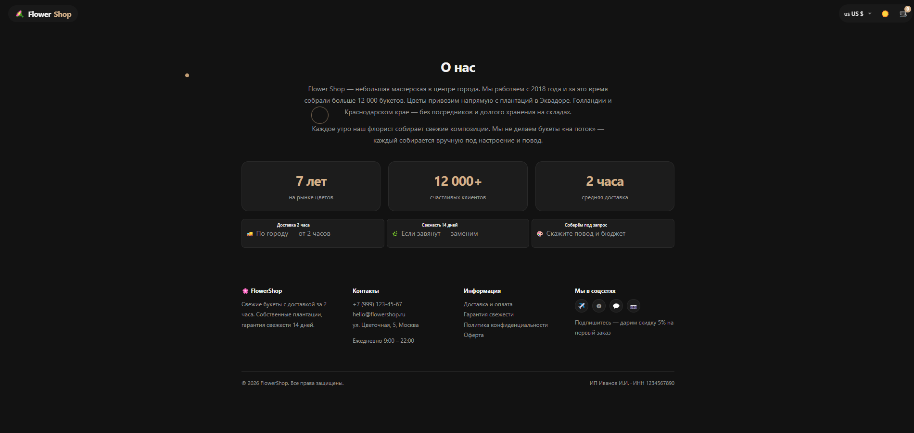
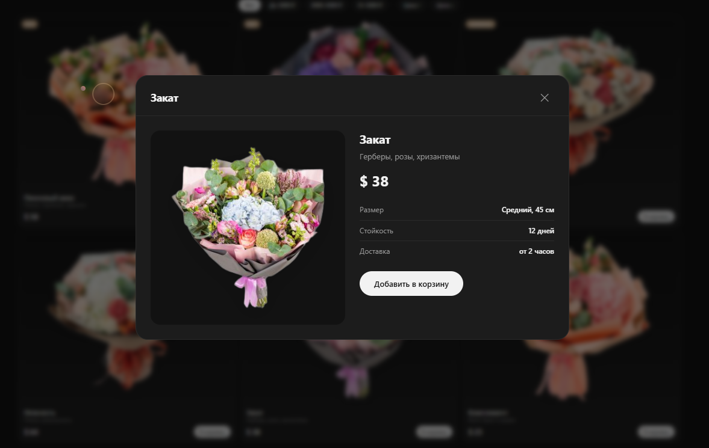
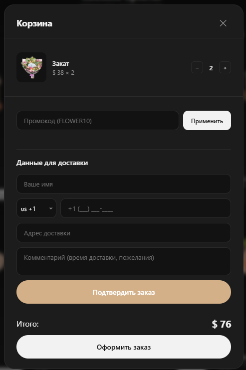

# 💐 Flower Shop

[](https://laravel.com)
[](https://php.net)
[](LICENSE)

> Интернет-магазин свежих букетов с доставкой за 2 часа. Laravel 12 + Blade + vanilla JS без тяжёлых фронтенд-фреймворков.

## 📑 Содержание

- [О проекте](#-о-проекте)
- [Скриншоты](#-скриншоты)
- [Стек](#-стек)
- [Функционал](#-функционал)
- [Архитектурные решения](#-архитектурные-решения)
- [Чему я научился](#-чему-я-научился)
- [Статистика проекта](#-статистика-проекта)
- [Структура проекта](#-структура-проекта)
- [Установка](#-установка)
- [Переменные окружения](#-переменные-окружения)
- [Telegram-интеграция](#-telegram-интеграция)
- [Маршруты](#️-маршруты)
- [База данных](#️-база-данных)
- [Мультивалютность](#-мультивалютность)
- [Особенности реализации](#-особенности-реализации)
- [Админка](#-админка)
- [Деплой](#-деплой)
- [Планы по развитию](#️-планы-по-развитию)
- [Тесты](#-тесты)
- [Лицензия](#-лицензия)
- [Контакты](#-контакты)

## 📖 О проекте

**Flower Shop** — полноценный интернет-магазин цветов с доставкой за 2 часа. Одностраничный лендинг на Laravel 12 + Blade + vanilla JS, без Vue/React и без сборщика. Заказы уходят напрямую в Telegram через Bot API. Есть простая админка для управления товарами.

Проект задуман как демонстрация того, что можно построить быстрый, лёгкий и функциональный магазин без тяжёлого фронтенд-стека — только PHP, Blade и чистый JavaScript.

**Что реализовано:**

- 🎠 Собственная hero-карусель (без Swiper) с бесконечным циклом, свайпами и адаптивным позиционированием
- 🛒 Корзина на `localStorage` с промокодом и мультивалютностью (5 валют)
- 🌓 Тёмная тема, кастомный курсор, прелоадер, анимации появления
- 📱 Адаптивная вёрстка (mobile-first) с touch-событиями
- 🤖 Отправка заказов в Telegram Bot API через HTTP-клиент Laravel
- ⚙️ Админка для CRUD товаров с загрузкой изображений
- 🎨 Кастомный скролл по секциям, скелетоны загрузки картинок
- 💱 Пересчёт цен на клиенте при смене страны (RU / US / EU / BY / KZ)

## 📸 Скриншоты

### Главная страница — hero-карусель


### Каталог с фильтрами и сортировкой


### Карточка товара (модалка с зумом)


### Корзина и оформление заказа


### Админка — управление товарами


## 🛠️ Стек

| Слой | Технология | Версия |
|------|-----------|--------|
| Backend | PHP + Laravel | 8.2+ / 12 |
| Frontend | Blade + Vanilla JS | ES6+ |
| Стили | CSS3 (custom properties, grid, flexbox) | — |
| БД | SQLite (по умолчанию) / MySQL / PostgreSQL | — |
| HTTP-клиент | Laravel HTTP Client (Guzzle) | — |
| Уведомления | Telegram Bot API | — |
| Аналитика | Яндекс.Метрика (опционально) | — |
| Инструменты | Vite 7, Tailwind 4, Pint, PHPUnit, Pail | — |

> Vite и Tailwind подключены «на будущее» — в `home.blade.php` не используются. Весь фронтенд — чистый CSS и JS без сборки.

## ✨ Функционал

### Витрина

- **Hero-карусель** — собственная реализация без Swiper: бесконечный цикл, 1 сосед слева / 1 справа, остальные скрыты. Работает с любым числом товаров (1, 2, 3, ...). Свайпы через Pointer Events.
- **Каталог** — сетка карточек с псевдо-скелетонами при загрузке картинок и анимацией появления.
- **Фильтры** — по цене (`до 3000`, `3000–5000`, `от 5000`).
- **Сортировка** — по цене ↑/↓.
- **Карточка товара** — модалка с зумом изображения, размером, стойкостью.
- **Мультивалютность** — RU / US / EU / BY / KZ, курсы заданы вручную в JS.
- **Тёмная тема** — переключатель в шапке, сохраняется в `localStorage`.
- **Кастомный курсор** — точка + кольцо, реагирует на интерактивные элементы (только desktop ≥ 1024px).
- **Прелоадер** — при первой загрузке.
- **Кастомный скролл** — перехват `wheel`, плавная прокрутка по секциям.

### Корзина и заказ

- Корзина хранится в `localStorage` (ключ `flowershop_cart`).
- Промокод **`FLOWER10`** — скидка 10%.
- Валидация формы: имя, телефон (маска по стране), адрес.
- **Отправка заказа → Telegram.** В БД заказы не сохраняются (by design — меньше оверхеда, real-time уведомления).
- Номер заказа генерируется случайно (`random_int(1000, 9999)`).
- Анимация «летящего букета» при добавлении товара.

### Админка

- URL: `/admin/products`
- CRUD товаров: список (пагинация 15/стр.), создание, редактирование, удаление.
- Загрузка картинок в `storage/app/public/products/` (PNG/JPG до 4 МБ).
- Открывается **по 5 кликам на логотип** на главной (в iframe-модалке).
- Валидация через `ProductController::validated()`.

## 🏗️ Архитектурные решения

| Решение | Почему |
|---------|--------|
| **Vanilla JS вместо Vue/React** | Лендинг не требует SPA-роутинга; меньше вес, быстрее загрузка, нет сборщика |
| **Корзина в `localStorage`** | Нет необходимости в серверных сессиях; работает без БД, мгновенный отклик |
| **Заказы только в Telegram** | Нет оверхеда на таблицу `orders`; уведомления приходят real-time менеджеру |
| **Своя карусель вместо Swiper** | Полный контроль над анимацией, нет зависимости (~30 КБ), уникальные позиции `pos-center/left/right` |
| **Один Blade-файл `home.blade.php`** | Быстрое прототипирование лендинга; всё в одном месте без разбиения на partials |
| **Курсы валют в JS** | Не требует внешних API, работает офлайн; при необходимости легко заменить на запрос к ЦБ |
| **Админка на 5 кликов по логотипу** | Скрытый вход без отдельной страницы логина — удобно для владельца-одиночки |
| **Аксессор `image_url` в модели** | Поддержка двух источников картинок: старых из `public/images/` и новых из `storage/` |

## 🧠 Чему я научился

- **Laravel 12** — новый стиль конфигурации через `bootstrap/app.php` (без `Kernel.php`), сервис-контейнер, Eloquent-аксессоры, HTTP-клиент
- **Собственная карусель** на Pointer Events без сторонних библиотек: расчёт позиций, бесконечный цикл через модульную арифметику, свайпы
- **Работа с `localStorage`** — корзина, тёмная тема, выбранная валюта, промокод (несколько независимых ключей)
- **Интеграция с Telegram Bot API** через HTTP-клиент Laravel: HTML-сообщения, эмодзи-флаги, форматирование заказа
- **Загрузка файлов** — валидация размера/типа, `storage:link`, аксессоры для генерации URL
- **Мультивалютность** — пересчёт цен на клиенте с сохранением выбора пользователя
- **Кастомный скролл** — перехват `wheel`, `easeInOutCubic`, прокрутка по секциям
- **Адаптивность** — mobile-first, медиа-запросы, `matchMedia`, touch-события
- **Анимации CSS** — скелетоны, пульсация бейджа, «летящий букет», прыгающая иконка корзины
- **Кастомный курсор** — точка + кольцо с задержкой через `requestAnimationFrame`, реакция на `:hover` интерактивных элементов

## 📊 Статистика проекта

- **Строк кода:** ~3500 (PHP + Blade + JS + CSS)
- **Контроллеров:** 3 (`HomeController`, `OrderController`, `Admin\ProductController`)
- **Моделей:** 2 (`Product`, `User`)
- **Сервисов:** 1 (`TelegramNotifier`)
- **Миграций:** 4
- **Blade-шаблонов:** 4 (`home`, `admin/layout`, `admin/products/index`, `admin/products/form`)
- **Маршрутов:** 11
- **Время разработки:** ~2 недели

## 📁 Структура проекта

```
.
├── app/
│   ├── Http/Controllers/
│   │   ├── Controller.php
│   │   ├── HomeController.php
│   │   ├── OrderController.php
│   │   └── Admin/ProductController.php
│   ├── Models/
│   │   ├── Product.php
│   │   └── User.php
│   ├── Providers/AppServiceProvider.php
│   └── Services/TelegramNotifier.php
├── bootstrap/app.php
├── config/services.php
├── database/migrations/
│   ├── 0001_01_01_000000_create_users_table.php
│   ├── 0001_01_01_000001_create_cache_table.php
│   ├── 0001_01_01_000002_create_jobs_table.php
│   └── 2026_09_21_130105_create_products_table.php
├── docs/screenshots/
│   ├── 1.png
│   ├── 2.png
│   ├── 3.png
│   ├── 4.png
│   └── 5.png
├── resources/views/
│   ├── home.blade.php
│   └── admin/
│       ├── layout.blade.php
│       └── products/
│           ├── index.blade.php
│           └── form.blade.php
├── routes/web.php
├── composer.json
├── package.json
└── .env.example
```

## 🚀 Установка

### Требования

- PHP **8.2+** с расширениями: `pdo_sqlite`, `mbstring`, `openssl`, `tokenizer`, `xml`, `ctype`, `json`, `curl`
- Composer 2
- Node.js 18+ (опционально — только для Vite)
- SQLite (по умолчанию) или MySQL/PostgreSQL

### Пошагово

```bash
git clone <repo-url> flowershop
cd flowershop
composer install
cp .env.example .env
php artisan key:generate
touch database/database.sqlite
php artisan migrate --seed
php artisan storage:link
npm install
npm run build
php artisan serve
```

Сайт: http://localhost:8000

### Быстрый старт

```bash
composer setup
```

Скрипт делает: `composer install`, копирует `.env`, генерит ключ, мигрирует БД, ставит npm-зависимости, собирает фронт.

### Режим разработки

```bash
composer dev
```

Запускает параллельно: `php artisan serve`, `queue:listen`, `pail`, `vite dev`.

## 🔐 Переменные окружения

Скопируйте `.env.example` → `.env` и заполните.

### Обязательные

| Переменная | Описание | Пример |
|-----------|----------|--------|
| `APP_KEY` | Ключ приложения | генерится `php artisan key:generate` |
| `APP_URL` | Базовый URL | `http://localhost` |
| `DB_CONNECTION` | Драйвер БД | `sqlite` |
| `TELEGRAM_BOT_TOKEN` | Токен бота | `123456:ABC-DEF...` |
| `TELEGRAM_CHAT_ID` | ID чата/канала | `-1001234567890` |

### Для MySQL / PostgreSQL

```env
DB_CONNECTION=mysql
DB_HOST=127.0.0.1
DB_PORT=3306
DB_DATABASE=flowershop
DB_USERNAME=root
DB_PASSWORD=
```

### Продакшн

```env
APP_ENV=production
APP_DEBUG=false
APP_URL=https://your-domain.com
```

## 🤖 Telegram-интеграция

Заказы уходят в Telegram через `App\Services\TelegramNotifier`.

### Как настроить

1. **Создайте бота** через [@BotFather](https://t.me/BotFather) → `/newbot` → получите токен.
2. **Узнайте chat_id**:
   - Напишите боту любое сообщение.
   - Откройте `https://api.telegram.org/bot<TOKEN>/getUpdates`.
   - Найдите `"chat":{"id": ...}` — это ваш chat_id.
   - Для канала: добавьте бота админом и используйте `@username` или ID вида `-100...`.
3. Пропишите в `.env`:

```env
TELEGRAM_BOT_TOKEN=123456:ABC-DEF...
TELEGRAM_CHAT_ID=-1001234567890
```

4. Очистите кэш конфига:

```bash
php artisan config:clear
```

### Формат сообщения

`TelegramNotifier::sendOrder()` отправляет HTML-сообщение с:

- Номером заказа, именем, телефоном, адресом, страной (с флагом)
- Валютой, в которой видел цены клиент (если не RUB)
- Комментарием
- Составом заказа (в рублях)
- Подытогом, скидкой, итогом
- Временем (МСК)

### Если токен не задан

`TelegramNotifier::send()` логирует `warning` и возвращает `false`. `OrderController` отвечает **500**, клиент видит ошибку.

## 🛣️ Маршруты

| Метод | URI | Контроллер | Назначение |
|-------|-----|-----------|-----------|
| GET | `/` | `HomeController@index` | Главная страница |
| POST | `/api/orders` | `OrderController@store` | Приём заказа → Telegram |
| GET | `/admin` | редирект | → `/admin/products` |
| GET | `/admin/products` | `Admin\ProductController@index` | Список товаров |
| GET | `/admin/products/create` | `Admin\ProductController@create` | Форма создания |
| POST | `/admin/products` | `Admin\ProductController@store` | Сохранить товар |
| GET | `/admin/products/{id}` | `Admin\ProductController@show` | → редирект на edit |
| GET | `/admin/products/{id}/edit` | `Admin\ProductController@edit` | Форма редактирования |
| PUT/PATCH | `/admin/products/{id}` | `Admin\ProductController@update` | Обновить товар |
| DELETE | `/admin/products/{id}` | `Admin\ProductController@destroy` | Удалить товар |
| GET | `/up` | — | Health check (Laravel 12) |

## 🗄️ База данных

### Таблица `products`

| Поле | Тип | Описание |
|------|-----|----------|
| `id` | bigint, PK | |
| `name` | string | Название |
| `description` | text, nullable | Описание |
| `price` | integer | Цена в рублях |
| `old_price` | integer, nullable | Старая цена (для зачёркивания) |
| `image` | string, nullable | Путь к картинке |
| `badge` | string, nullable | Бейдж: «Хит», «Новинка» и т.п. |
| `size` | string, nullable | Размер букета |
| `life` | string, nullable | Стойкость |
| `created_at`, `updated_at` | timestamp | |

### Логика `image_url`

Аксессор `Product::getImageUrlAttribute()`:

- Если `image` пустой → `asset('images/placeholder.png')`.
- Если начинается с `products/` → `asset('storage/' . $image)` (новые загрузки через админку).
- Иначе → `asset($image)` (старые картинки из `public/images/`).

### Заказы

Таблицы `orders` нет — это осознанное решение. Заказы не сохраняются в БД, а сразу уходят в Telegram. Если нужна история — см. раздел «Планы по развитию».

## 💱 Мультивалютность

Реализована на фронте в `home.blade.php`. Курсы заданы в JS:

```js
const EXCHANGE_RATES = {
  RUB: 1,
  USD: 1 / 84.20,
  EUR: 1 / 98.50,
  BYN: 1 / 27.86,
  KZT: 1 / 0.16
};
```

Базовая валюта — **RUB**. При смене страны все цены на странице пересчитываются. Выбор сохраняется в `localStorage` под ключом `flowershop_country`.

> Чтобы обновлять курсы автоматически, замените `EXCHANGE_RATES` на запрос к API ЦБ или внешнему сервису.

## 🎨 Особенности реализации

### Корзина в `localStorage`

- Ключ: `flowershop_cart`
- Формат: `[{ name, price, img, qty }, ...]`
- Промокод хранится в переменной `discount` (не персистится).
- Бейдж корзины пульсирует при добавлении, иконка «подпрыгивает».
- При добавлении — анимация «летящего букета» из кнопки в корзину.

### Hero-карусель без Swiper

Собственная реализация (IIFE в конце `<script>`):

- Классы позиций: `pos-center`, `pos-left`, `pos-right`, `pos-hidden-left`, `pos-hidden-right`.
- Активный индекс зацикливается: `(activeIndex + direction + total) % total`.
- Клик по центру → скролл к каталогу + открытие модалки товара.
- Клик по боковому → перелистывание.
- Свайпы через Pointer Events.

Если товаров с `badge` нет — берутся все товары. Если товар один — кнопки навигации скрываются.

### Кастомный скролл

Контейнер `.scroll-container` перехватывает `wheel` и скроллит по секциям (по одной за раз) с плавной анимацией через `easeInOutCubic`.

### Скелетоны

У карточек каталога — псевдо-скелетон через `::before` с анимацией `skeleton`. Убирается после `load` картинки.

### Кастомный курсор

При `window.matchMedia('(min-width: 1024px)')` включается кастомный курсор: точка следует за мышью, кольцо догоняет с задержкой через `requestAnimationFrame`. На интерактивных элементах кольцо растёт.

## 🔧 Админка

### Как попасть

На главной странице **5 раз подряд кликните на логотип** (`FlowerShop` в левом верхнем углу) в течение 1.5 секунд. Откроется модалка с iframe на `/admin/products`.

### Возможности

- Список товаров с пагинацией (15 на страницу).
- Создание / редактирование / удаление.
- Загрузка картинок: PNG/JPG до 4 МБ, сохраняются в `storage/app/public/products/`.
- Валидация через `ProductController::validated()`.

### Форма товара

Поля: `name*`, `description`, `price*`, `old_price`, `badge`, `size`, `life`, `image_file`.

> ⚠️ Админка изолирована по URL. Для продакшна рекомендуется закрыть её middleware `auth` — см. раздел «Планы по развитию».

## 🚢 Деплой

### Продакшн-чеклист

```bash
composer install --no-dev --optimize-autoloader
php artisan config:cache
php artisan route:cache
php artisan view:cache
php artisan migrate --force
php artisan storage:link
chmod -R 775 storage bootstrap/cache
chown -R www-data:www-data storage bootstrap/cache
```

### Что проверить

- `APP_DEBUG=false` — иначе утечка стектрейсов.
- `TELEGRAM_BOT_TOKEN` и `TELEGRAM_CHAT_ID` заданы.
- `php artisan config:clear` после изменения `.env`.
- Не коммитить `.env` и `database/database.sqlite`.
- Настроить HTTPS.
- Закрыть `/admin/*` авторизацией.

## 🗺️ Планы по развитию

- [ ] Авторизация в админке (`auth` middleware + Laravel Breeze)
- [ ] Таблица `orders` для истории заказов
- [ ] Интеграция с API ЦБ РФ для актуальных курсов валют
- [ ] Таблица промокодов с гибкими правилами
- [ ] Онлайн-оплата (ЮKassa / Stripe)
- [ ] Личный кабинет пользователя
- [ ] Telegram-уведомления клиенту о статусе заказа
- [ ] Покрытие тестами бизнес-логики (Pest/PHPUnit)
- [ ] CI/CD через GitHub Actions
- [ ] Замена `home.blade.php` на набор partials

## 🧪 Тесты

```bash
php artisan test
```

Или через composer:

```bash
composer test
```

## 📝 Лицензия

MIT

## 📞 Контакты

- **Email:** ditlate0@gmail.com
- **Instagram:** [@prod_23b](https://www.instagram.com/prod_23b/)
- **GitHub:** [@23b](https://github.com/ditlate0-spec)